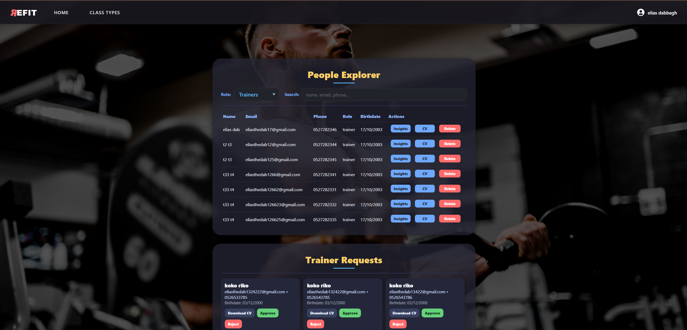

# 🏋️ Gym Management System

A full-stack web application for managing gym memberships, classes, trainers, and payments.  
Built with **React (frontend)**, **Node.js + Express (backend)**, and **MySQL** as the database.  
Integrated with **PayPal** for membership payments.

---

## 🚀 Features

### 👤 Members
- Register and log in securely  
- Purchase / renew memberships via PayPal  
- View and edit personal profile  
- Browse available classes by type and date  
- Book or cancel classes  
- View booking history and remaining membership status  

### 🧑‍🏫 Trainers
- Apply to become a trainer (CV upload)  
- Add, modify, or cancel classes  
- Prevent duplicate bookings for the same timeslot  
- View class rosters and participant counts  
- Manage personal schedule  

### 👨‍💼 Admin
- Approve or deny trainer requests  
- Manage users, members, and trainers  
- Define and edit class types  
- Assign trainers and set class capacities  
- Analytics dashboard with insights  

### 👥 Guests
- Browse public information  
- Register an account  
- Apply as a trainer  

---

## 🛠️ Tech Stack

- **Frontend:** React, TailwindCSS, shadcn/ui  
- **Backend:** Node.js, Express  
- **Database:** MySQL  
- **Payments:** PayPal integration  
- **Authentication:** Session-based role access  

---

## ⚡ Getting Started

### 1. Clone the repo
```bash
git clone https://github.com/YOUR-USERNAME/Gym-management-system-project.git
cd Gym-management-system-project
2. Setup backend
bash
Copy code
cd NodeArticles
npm install
npm start
3. Setup frontend
bash
Copy code
cd ReactArticles
npm install
npm start
4. Database
Import the MySQL schema from /database/schema.sql

Update .env with your MySQL credentials

💳 Payments
This system uses PayPal Sandbox for test transactions.
Update your PayPal client ID and secret in the backend .env file.

## 📸 Screenshots

### Admin View


### Trainer View


### Member View


